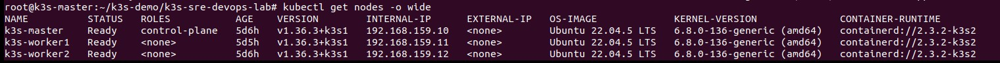
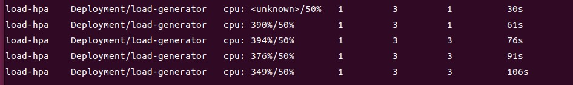
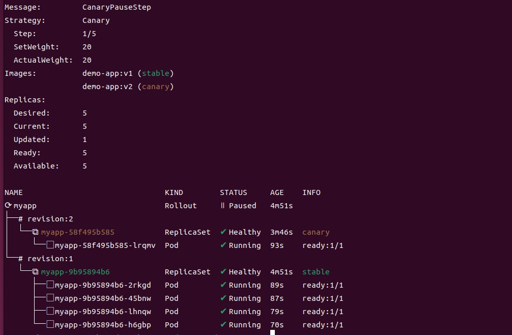
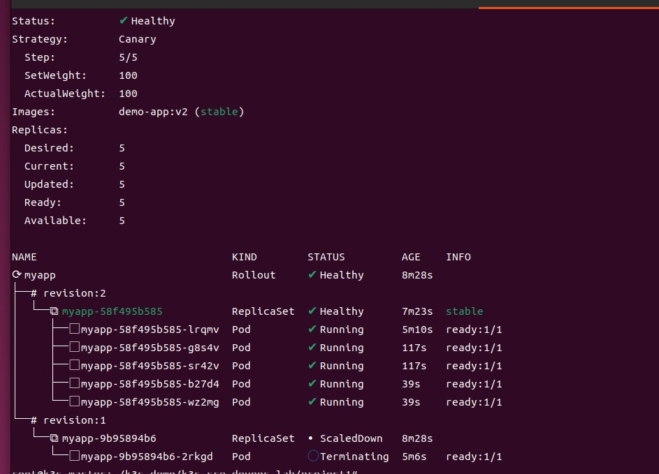
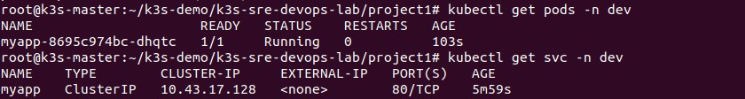

# Project 1: 持续交付与金丝雀发布 (CI/CD & Rollouts)

基于 K3s 集群的微服务交付实践，涵盖多环境管理、HPA 弹性伸缩、Argo Rollouts 金丝雀发布。

## 📁 目录结构
project1/
├── app/
│ └── main.py # Flask 应用
├── Dockerfile
├── requirements.txt
├── k8s/
│ ├── base/ # 基础配置
│ │ ├── deployment.yaml
│ │ ├── service.yaml
│ │ └── kustomization.yaml
│ └── overlays/
│ ├── dev/ # dev 环境
│ │ ├── kustomization.yaml
│ │ └── deployment-patch.yaml
│ └── staging/ # staging 环境
│ ├── kustomization.yaml
│ └── deployment-patch.yaml
├── hpa.yaml # HPA 弹性伸缩配置
├── rollout.yaml # Argo Rollouts 金丝雀策略
├── local-ci.sh # CI/CD 模拟脚本
└── screenshots/ # 验证截图

 技术栈

- **应用**：Python Flask + Gunicorn
- **编排**：Kubernetes (K3s) + Kustomize
- **弹性伸缩**：HPA
- **发布策略**：Argo Rollouts (金丝雀)
- **CI/CD**：GitLab CI（模拟）

## 🎯 核心功能

- **多环境管理**：Kustomize 管理 dev / staging 配置
- **弹性伸缩**：HPA 基于 CPU 自动扩缩容
- **金丝雀发布**：20% → 50% → 100% 逐步切换流量
- **本地 CI 模拟**：构建 → 导入 → 部署 → 回滚
## 📸 验证截图

### 集群节点状态

### HPA 自动扩缩容

### 金丝雀发布（20% → 50% 流量切换）

### Service 健康检查

