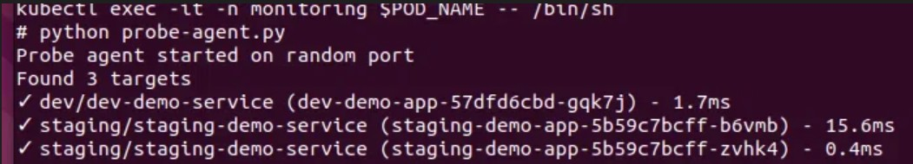
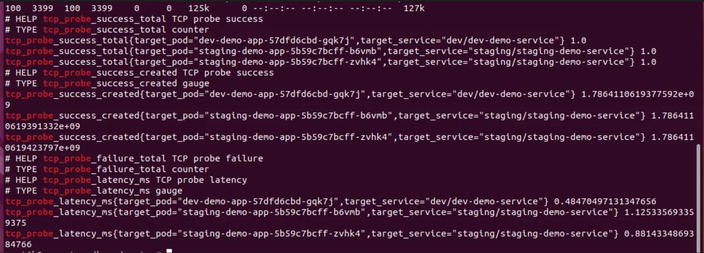

# 项目二：K8s 集群服务网络质量拨测系统

## 项目概述
通过 DaemonSet 部署的 Python Agent，通过 K8s API 自动发现 Service，做 TCP 探测，暴露 Prometheus 指标。

## 技术栈
Python + kubernetes-client + prometheus-client + DaemonSet + Prometheus

## 核心能力
1. 自动服务发现（Watch Service/Endpoints，无需手动配置）
2. TCP 连通性探测（成功率 + 延迟）
3. Prometheus 指标暴露（probe_success / probe_duration / probe_total）
4. 告警规则（企业微信推送）

## 📸 验证截图

### Agent 自动发现 Service

### DaemonSet Pod 运行状态

### Prometheus 指标采集

