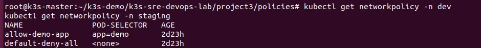
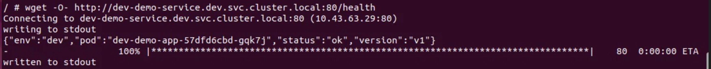

# 项目三：NetworkPolicy 网络隔离与故障演练

## 项目概述

在 K3s 集群上通过 NetworkPolicy 实现零信任网络隔离，并通过故障演练验证策略有效性。

> **注意**：K3s 默认 CNI（Flannel）不支持 NetworkPolicy，需切换至 Calico。

## 🎯 核心功能

- **CNI 迁移**：从 K3s 默认 Flannel 迁移至 Calico
- **默认拒绝**：deny-all 策略，零信任网络模型
- **精细化放行**：只允许 monitoring namespace 访问 dev 环境的 demo-app
- **故障演练**：
  - 场景1：错误策略导致服务中断 → 定位 → 恢复
  - 场景2：数据库访问隔离（只允许特定 Pod 访问）

## 📸 验证截图

### NetworkPolicy 资源列表

### deny-all 阻断流量

### allow 策略生效

# 应用策略
kubectl apply -f policies/deny-all.yaml -n dev
kubectl apply -f policies/allow-demo-app.yaml -n dev

# 查看策略
kubectl get networkpolicy -n dev

# 测试（预期失败）
kubectl run test --image=busybox --rm -it -n dev -- wget -qO- --timeout=3 http://myapp:5000/
